# Backend Architecture Design

## 1. Introduction & Design Philosophy

### Purpose
This document outlines the architectural philosophy and recommended technology stack for building modern, scalable, and type-safe backends that complement the Carrot Web Game Template. The primary goal is to create a blueprint that prioritizes developer experience and robust performance.

### Core Principles
-   **End-to-End Type Safety**: Eliminate a whole class of runtime errors by ensuring that types flow seamlessly from the database to the backend and all the way to the frontend React components. What you query from the database is what you get on the client, guaranteed.
-   **High Performance**: Utilize a low-overhead, high-throughput web framework to handle requests efficiently, ensuring the backend is never a bottleneck.
-   **Developer Experience**: Minimize boilerplate and manual type-wrangling. The development process should feel fast, intuitive, and enjoyable, with excellent autocompletion and clear error messages.
-   **Modularity & Scalability**: The architecture should be organized in a way that is easy to understand, maintain, and extend as the project grows.

## 2. Recommended Technology Stack

| Layer        | Technology                                 | Why?                                                                                                                                              |
|--------------|--------------------------------------------|---------------------------------------------------------------------------------------------------------------------------------------------------|
| **Framework**  | [**Fastify**](https://www.fastify.io/)     | Blazing fast performance with minimal overhead. Its plugin-based architecture is powerful and it has first-class TypeScript support.                |
| **API Layer**  | [**tRPC**](https://trpc.io/)               | The cornerstone of our type-safe approach. It requires **no code generation** and allows you to write API endpoints that feel like calling local functions from the frontend. |
| **Database ORM** | [**Prisma**](https://www.prisma.io/)       | A next-generation ORM that provides a fully type-safe database client based on your schema. It makes database queries intuitive and safe.        |
| **Database**   | [**PostgreSQL**](https://www.postgresql.org/) / [**SQLite**](https://www.sqlite.org/index.html) | PostgreSQL for production robustness; SQLite for zero-config, file-based local development and simple prototypes. Prisma supports both seamlessly. |

## 3. Data Flow Diagram

This diagram illustrates how data and types flow through the entire stack, creating a single, coherent system.

```mermaid
graph TD
    subgraph "💻 Frontend (Your React App)"
        A[React Component] --> B{tRPC Client};
    end

    subgraph "🚀 Backend (Fastify Server)"
        B --"HTTP Request"--> C[Fastify Adapter];
        C --> D[tRPC Router];
        D --"Calls procedure"--> E[Service/Logic];
    end
    
    subgraph "💾 Database"
        E --"Database Query"--> F[Prisma Client];
        F --"SQL"--> G[(PostgreSQL/SQLite)];
        G --"Data"--> F;
        F --"Typed Results"--> E;
    end

    E --"Typed Response"--> D;
    D --"JSON Response"--> C;
    C --"Types auto-inferred"--> B;
    B --"Fully-typed data & hooks"--> A;

    linkStyle 1 stroke:#2980b9,stroke-width:2px;
    linkStyle 2 stroke:#2980b9,stroke-width:2px;
    linkStyle 3 stroke:#27ae60,stroke-width:2px;
    linkStyle 8 stroke:#27ae60,stroke-width:2px;
    linkStyle 9 stroke:#2980b9,stroke-width:2px;
    linkStyle 10 stroke:#2980b9,stroke-width:2px;
    
    style A fill:#ecf0f1,stroke:#34495e;
    style B fill:#3498db,stroke:#2980b9,color:#fff;
    style C fill:#9b59b6,stroke:#8e44ad,color:#fff;
    style D fill:#e67e22,stroke:#d35400,color:#fff;
    style E fill:#ecf0f1,stroke:#34495e;
    style F fill:#1abc9c,stroke:#16a085,color:#fff;
    style G fill:#f1c40f,stroke:#f39c12;
``` 

